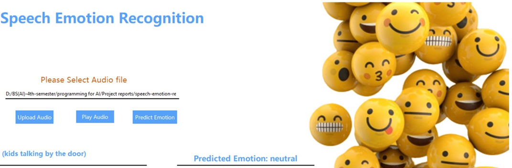

#  Speech Emotion Recognition using Deep Learning

This project implements a deep learning-based system to recognize human emotions from speech signals. By extracting Mel-Frequency Cepstral Coefficients (MFCCs) from audio and feeding them into a Convolutional Neural Network (CNN), it classifies speech into emotional categories with high accuracy. A Tkinter-based GUI is included for live testing and real-time predictions.


## Overview

- **Goal:** Predict human emotion from audio using deep learning.
- **Approach:** Feature extraction using MFCCs + CNN model.
- **Scope:** Academic project for the course "Deep Learning".
- **Interface:** Tkinter-based GUI for live interaction (optional).


## Project Structure

```

Speech-Emotion-Recognition/
│
├── Speech_emotion_recognition.ipynb    # Core notebook (data prep, training, testing)
├── GUI.png                             # Screenshot of the GUI
├── requirements.txt                    # Required Python libraries
└── README.md                           # Project documentation

````

## Emotions Detected

The model classifies speech into the following emotions:

- 😐 Neutral  
- 😊 Happy  
- 😢 Sad  
- 😠 Angry  
- 😨 Fearful  
- 😖 Disgust  
- 😲 Surprise  


## Datasets Used

This project uses publicly available emotional speech datasets:

1. **RAVDESS (Ryerson Audio-Visual Database of Emotional Speech and Song)**  
   🎵 Download: [Kaggle - RAVDESS Emotional Speech Audio](https://www.kaggle.com/datasets/uwrfkaggler/ravdess-emotional-speech-audio)

2. **SAVEE (Surrey Audio-Visual Expressed Emotion)**  
   🎵 Download: [Official Website - SAVEE](https://zenodo.org/record/1188976)

3. **TESS (Toronto Emotional Speech Set)**  
   🎵 Download: [TESS Dataset](https://tspace.library.utoronto.ca/handle/1807/24487)

Ensure you download and place the datasets in the appropriate folder structure before running the notebook.


## Technologies & Libraries

| Tool / Library     | Role                                |
|--------------------|-------------------------------------|
| Python             | Main programming language           |
| Librosa            | Audio preprocessing & MFCCs         |
| TensorFlow / Keras | Deep learning model implementation  |
| NumPy, Pandas      | Data handling and manipulation      |
| Matplotlib         | Visualization of model performance  |
| Tkinter            | GUI interface for live prediction   |


## How to Run

### 1. Clone the Repository

```bash
git clone https://github.com/areebaghazal88/Speech-Emotion-Recognition-using-Deep-learning.git
cd Speech-Emotion-Recognition
````

### 2. Install Dependencies

```bash
pip install -r requirements.txt
```

### 3. Run the Notebook

```bash
jupyter notebook Speech_emotion_recognition.ipynb
```


## GUI Preview

Below is a screenshot of the graphical interface used for real-time emotion prediction:




## Results

* CNN achieved 95% accuracy in detecting emotional speech patterns.
* Loss and accuracy plots show stable convergence.
* Real-time prediction via GUI demonstrated effective generalization.

Example Output:

```
Input: speech.wav → Predicted: Angry 😠
```


